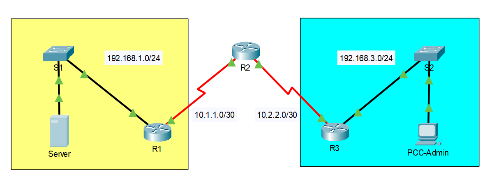

# Packet Tracer - Configure IP ACLs to Mitigate Attacks

## Overview

**Objectives:**

- Verify connectivity among devices before firewall configuration.
- Use ACLs to ensure remote access to the routers is available only from the management station PC-C.
- Configure ACLs on R1 and R3 to mitigate attacks.
- Verify ACL functionality.

**Background/Scenario:**

Access to routers R1, R2, and R3 should only be permitted from PC-C, the management station. PC-C is also used for connectivity testing to PC-A, which is a server providing DNS, SMTP, FTP, and HTTPS services.

Standard operating procedure is to apply ACLs on edge routers to mitigate common threats based on source and destination IP address. In this activity, you will create ACLs on edge routers R1 and R3 to achieve this goal. You will then verify ACL functionality from internal and external hosts.

https://github.com/pabs3745/acls-mitigate-attacks/blob/master/2023-07-10%2016_44_03-Cisco%20Packet%20Tracer.png

## IP addressing scheme

## Addressing Table

| Device | Interface | IP Address | Subnet Mask | Default Gateway | Switch Port |
|--------|-----------|------------|-------------|-----------------|-------------|
| R1     | G0/1      | 192.168.1.1 | 255.255.255.0 | N/A             | S1 F0/5     |
|        | S0/0/0 (DCE) | 10.1.1.1   | 255.255.255.252 | N/A             | N/A         |
| R2     | S0/0/0    | 10.1.1.2   | 255.255.255.252 | N/A             | N/A         |
|        | S0/0/1 (DCE) | 10.2.2.2   | 255.255.255.252 | N/A             | N/A         |
|        | Lo0       | 192.168.2.1 | 255.255.255.0 | N/A             | N/A         |
| R3     | G0/1      | 192.168.3.1 | 255.255.255.0 | N/A             | S3 F0/5     |
|        | S0/0/1    | 10.2.2.1   | 255.255.255.252 | N/A             | N/A         |
| PC-A   | NIC       | 192.168.1.3 | 255.255.255.0 | 192.168.1.1     | S1 F0/6     |
| PC-C   | NIC       | 192.168.3.3 | 255.255.255.0 | 192.168.3.1     | S3 F0/18    |

## Part 1
## Basic configuration

Enable password: ciscoenpa55
o Password for the console: ciscoconpa55
o SSH logon username and password: SSHadmin/ciscosshpa55
o IP addressing
o Static routing

## Part 2
## Secure Access to Routers

### Step 1: Configure ACL 10 to block all remote access to the routers except from PC-C.
Use the `access-list` command to create a numbered IP ACL on R1, R2, and R3.

R1(config)# access-list 10 permit host 192.168.3.3
R2(config)# access-list 10 permit host 192.168.3.3
R3(config)# access-list 10 permit host 192.168.3.3

### Step 2: Apply ACL 10 to ingress traffic on the VTY lines.
Use the `access-class` command to apply the access list to incoming traffic on the VTY lines.

R1(config-line)# access-class 10 in
R2(config-line)# access-class 10 in
R3(config-line)# access-class 10 in

## Step 3: Verify exclusive access from management station PC-C.

a. Establish an SSH session to 192.168.2.1 from PC-C (should be successful).

PC> ssh –l SSHadmin 192.168.2.1

b. Establish an SSH session to 192.168.2.1 from PC-A (should fail).

## Create a Numbered IP ACL 120 on R1

Create an IP ACL numbered 120 with the following rules:
- Permit any outside host to access DNS, SMTP, and FTP services on server PC-A.
- Deny any outside host access to HTTPS services on PC-A.
- Permit PC-C to access R1 via SSH.

## Part 3
## 1

Be sure to disable HTTP and enable HTTPS on server PC-A.

## 2 

Use the `access-list` command to create a numbered IP ACL.

R1(config)# access-list 120 permit udp any host 192.168.1.3 eq domain
R1(config)# access-list 120 permit tcp any host 192.168.1.3 eq smtp
R1(config)# access-list 120 permit tcp any host 192.168.1.3 eq ftp
R1(config)# access-list 120 deny tcp any host 192.168.1.3 eq 443
R1(config)# access-list 120 permit tcp host 192.168.3.3 host 10.1.1.1 eq 22

## 3 

Apply the ACL to interface S0/0/0.

Use the `ip access-group` command to apply the access list to incoming traffic on interface S0/0/0.

R1(config)# interface s0/0/0
R1(config-if)# ip access-group 120 in

## 4 

Verify that PC-C cannot access PC-A via HTTPS using the web browser.

