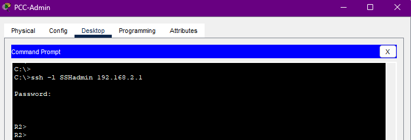

# Packet Tracer - Configure IP ACLs to Mitigate Attacks

## Overview

**Objectives:**

- Verify connectivity among devices before firewall configuration.
- Use ACLs to ensure remote access to the routers is available only from the management station PC-C.
- Configure ACLs on R1 and R3 to mitigate attacks.
- Verify ACL functionality.

**Background/Scenario:**

Access to routers R1, R2, and R3 should only be permitted from PC-C, the management station. PC-C is also used for connectivity testing to PC-A, which is a server providing DNS, SMTP, FTP, and HTTPS services.

Standard operating procedure is to apply ACLs on edge routers to mitigate common threats based on source and destination IP address. In this activity, you will create ACLs on edge routers R1 and R3 to achieve this goal. You will then verify ACL functionality from internal and external hosts.

## IP addressing scheme

## Addressing Table

| Device | Interface | IP Address | Subnet Mask | Default Gateway | Switch Port |
|--------|-----------|------------|-------------|-----------------|-------------|
| R1     | G0/1      | 192.168.1.1 | 255.255.255.0 | N/A             | S1 F0/5     |
|        | S0/0/0 (DCE) | 10.1.1.1   | 255.255.255.252 | N/A             | N/A         |
| R2     | S0/0/0    | 10.1.1.2   | 255.255.255.252 | N/A             | N/A         |
|        | S0/0/1 (DCE) | 10.2.2.2   | 255.255.255.252 | N/A             | N/A         |
|        | Lo0       | 192.168.2.1 | 255.255.255.0 | N/A             | N/A         |
| R3     | G0/1      | 192.168.3.1 | 255.255.255.0 | N/A             | S3 F0/5     |
|        | S0/0/1    | 10.2.2.1   | 255.255.255.252 | N/A             | N/A         |
| PC-A   | NIC       | 192.168.1.3 | 255.255.255.0 | 192.168.1.1     | S1 F0/6     |
| PC-C   | NIC       | 192.168.3.3 | 255.255.255.0 | 192.168.3.1     | S3 F0/18    |

## Part 1
## Basic configuration

Enable password: ciscoenpa55
o Password for the console: ciscoconpa55
o SSH logon username and password: SSHadmin/ciscosshpa55
o IP addressing
o Static routing

## Part 2
### Secure Access to Routers

### Step 1: Configure ACL 10 to block all remote access to the routers except from PC-C.
Use the `access-list` command to create a numbered IP ACL on R1, R2, and R3.

R1(config)# access-list 10 permit host 192.168.3.3
R2(config)# access-list 10 permit host 192.168.3.3
R3(config)# access-list 10 permit host 192.168.3.3

### Step 2: Apply ACL 10 to ingress traffic on the VTY lines.
Use the `access-class` command to apply the access list to incoming traffic on the VTY lines.

R1(config-line)# access-class 10 in
R2(config-line)# access-class 10 in
R3(config-line)# access-class 10 in

### Step 3: Verify exclusive access from management station PC-C.

a. Establish an SSH session to 192.168.2.1 from PC-C (should be successful).

PC> ssh –l SSHadmin 192.168.2.1

b. Establish an SSH session to 192.168.2.1 from the server (should fail).

### Create a Numbered IP ACL 120 on R1

Create an IP ACL numbered 120 with the following rules:
- Permit any outside host to access DNS, SMTP, and FTP services on server PC-A.
- Deny any outside host access to HTTPS services on PC-A.
- Permit PC-C to access R1 via SSH.

## Part 3
### 1

Be sure to disable HTTP and enable HTTPS on server.

https://github.com/pabs3745/acls-mitigate-attacks/blob/master/server1.png

### 2 

Use the `access-list` command to create a numbered IP ACL.

R1(config)# access-list 120 permit udp any host 192.168.1.3 eq domain
R1(config)# access-list 120 permit tcp any host 192.168.1.3 eq smtp
R1(config)# access-list 120 permit tcp any host 192.168.1.3 eq ftp
R1(config)# access-list 120 deny tcp any host 192.168.1.3 eq 443
R1(config)# access-list 120 permit tcp host 192.168.3.3 host 10.1.1.1 eq 22

### 3 

Apply the ACL to interface S0/0/0.

Use the `ip access-group` command to apply the access list to incoming traffic on interface S0/0/0.

R1(config)# interface s0/0/0
R1(config-if)# ip access-group 120 in

### 4 

Verify that PC-C cannot access server via HTTPS using the web browser.

https://github.com/pabs3745/acls-mitigate-attacks/blob/master/https.png

## Part 4: Modify an Existing ACL on R1

Permit ICMP echo replies and destination unreachable messages from the outside network (relative to R1).
Deny all other incoming ICMP packets.

### Step 1: Verify that PC-A cannot successfully ping the loopback interface on R2.

### Step 2: Make any necessary changes to ACL 120 to permit and deny the specified traffic.

Use the `access-list` command to create a numbered IP ACL.

R1(config)# access-list 120 permit icmp any any echo-reply
R1(config)# access-list 120 permit icmp any any unreachable
R1(config)# access-list 120 deny icmp any any
R1(config)# access-list 120 permit ip any any

### Step 3: Verify that PC-A can successfully ping the loopback interface on R2.

After making the necessary changes to ACL 120, verify that PC-A can successfully ping the loopback interface on R2.

https://github.com/pabs3745/acls-mitigate-attacks/blob/master/ping1.png

## Part 5: Create a Numbered IP ACL 110 on R3

Deny all outbound packets with source address outside the range of internal IP addresses on R3.

### Step 1: Configure ACL 110 to permit only traffic from the inside network.

Use the `access-list` command to create a numbered IP ACL.

R3(config)# access-list 110 permit ip 192.168.3.0 0.0.0.255 any

### Step 2: Apply the ACL to interface G0/1.

Use the `ip access-group` command to apply the access list to incoming traffic on interface G0/1.

R3(config)# interface g0/1
R3(config-if)# ip access-group 110 in

## Part 6: Create a Numbered IP ACL 100 on R3

On R3, block all packets containing the source IP address from the following pool of addresses: any RFC
1918 private addresses, 127.0.0.0/8, and any IP multicast address. Since PC-C is being used for remote
administration, permit SSH traffic from the 10.0.0.0/8 network to return to the host PC-C.

### Step 1: Configure ACL 100 to block all specified traffic from the outside network.

You should also block traffic sourced from your own internal address space if it is not an RFC 1918 address.
In this activity, your internal address space is part of the private address space specified in RFC 1918.

Use the `access-list` command to create a numbered IP ACL.

R3(config)# access-list 100 permit tcp 10.0.0.0 0.255.255.255 eq 22 host 192.168.3.3
R3(config)# access-list 100 deny ip 10.0.0.0 0.255.255.255 any
R3(config)# access-list 100 deny ip 172.16.0.0 0.15.255.255 any
R3(config)# access-list 100 deny ip 192.168.0.0 0.0.255.255 any
R3(config)# access-list 100 deny ip 127.0.0.0 0.255.255.255 any
R3(config)# access-list 100 deny ip 224.0.0.0 15.255.255.255 any
R3(config)# access-list 100 permit ip any any

### Step 2: Apply the ACL to interface Serial 0/0/1.

Use the `ip access-group` command to apply the access list to incoming traffic on interface Serial 0/0/1.

R3(config)# interface s0/0/1
R3(config-if)# ip access-group 100 in

### Step 3: Confirm that the specified traffic entering interface Serial 0/0/1 is handled correctly.

a. From the server command prompt, ping the PC-A server. The ICMP echo replies are blocked by the ACL
since they are sourced from the 192.168.0.0/16 address space.

https://github.com/pabs3745/acls-mitigate-attacks/blob/master/ping3.png

b. Establish an SSH session to 192.168.2.1 from PC-C (should be successful).

https://github.com/pabs3745/acls-mitigate-attacks/blob/master/ssh3.png

